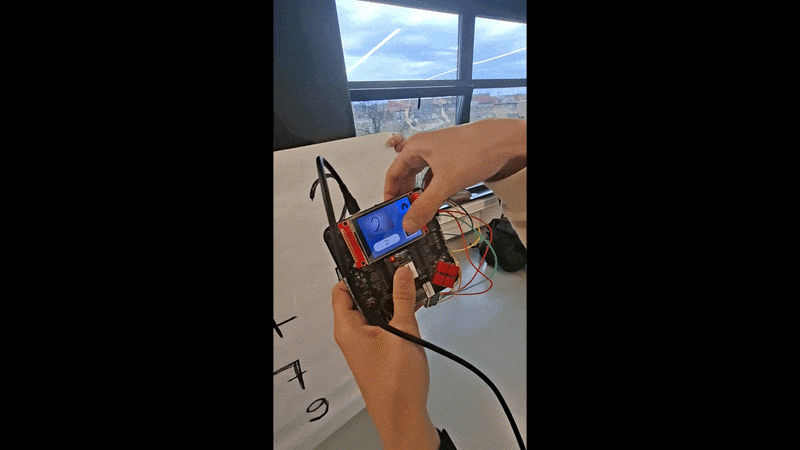
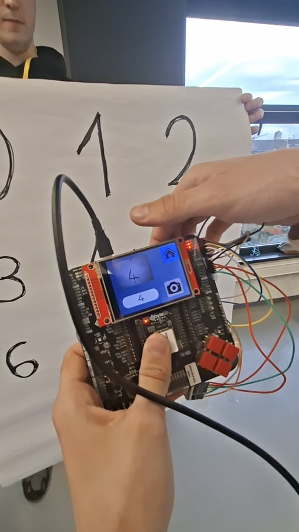
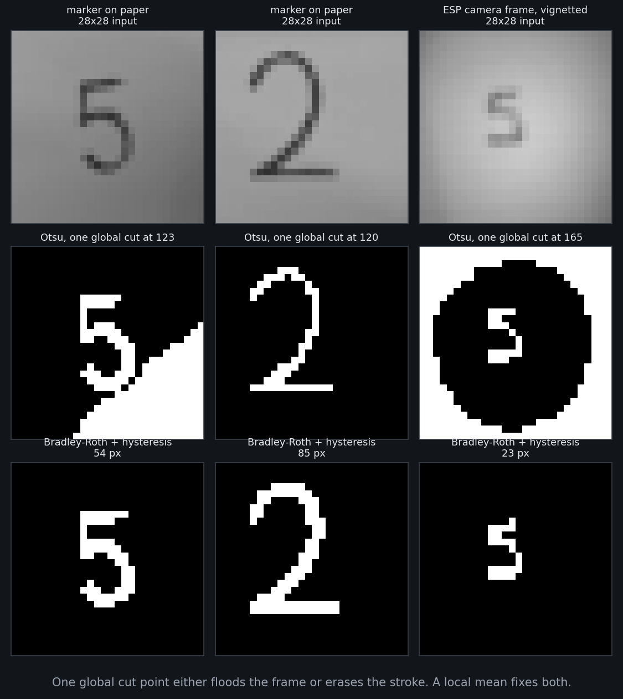
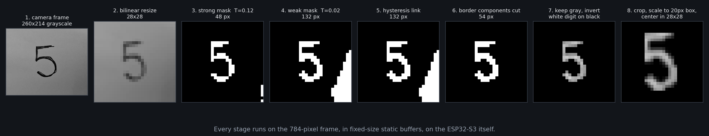
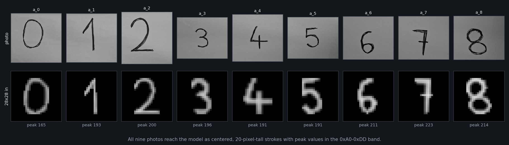
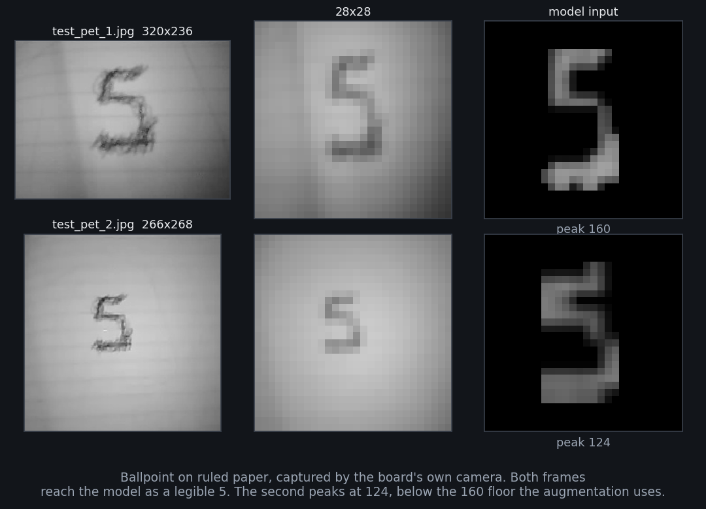
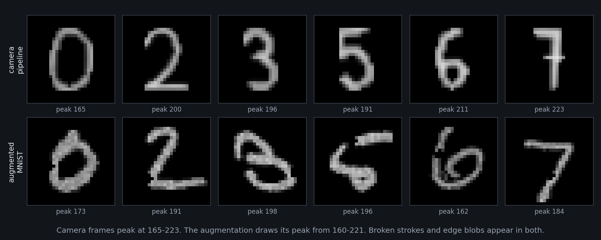
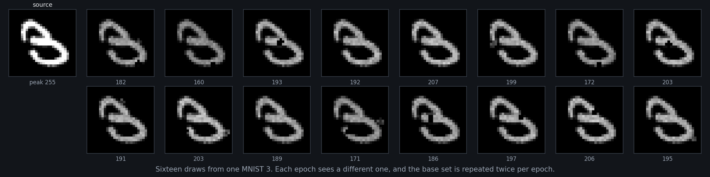
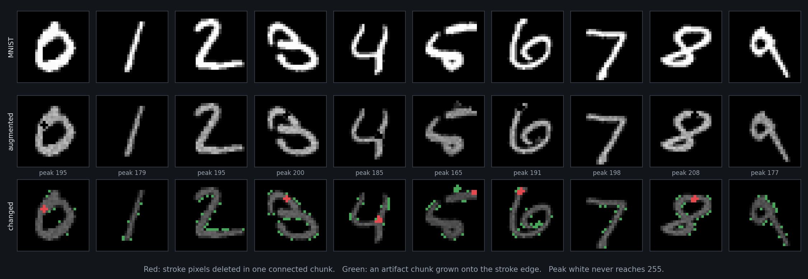

# Digit recognition on an ESP32-S3



An ESP32-S3 with a camera module reads a handwritten digit off paper and classifies it on the
chip. The classifier is a 16,966-parameter convolutional network quantized to int8: 26,448 bytes
in flash, 13,556 bytes of static preprocessing workspace, no dynamic allocation anywhere in the
image path. This repository holds the inference component. The camera driver and the display
belong to the rest of the team project.

A capture is a 320x236 grayscale photograph of ballpoint pen on ruled paper. The lighting falls
off toward the frame edges, the paper texture sits at a contrast comparable to the ink, and the
network takes a 28x28 frame in the MNIST convention: one white stroke on black, scaled to a
20-pixel box and centered in the canvas. Four thresholding methods were implemented and compared
before one held across the captures the board produces. The augmentation described below was
written from measurements of what the finished chain outputs, rather than from a standard list of
image transforms.



*The preview on the LCD is the crop the preprocessing receives. The digit fills the frame, which
is the regime the whole chain is built for.*

---

## The platform, and what it forbids

The target is an ESP32-S3 at 160 MHz with 2 MB of flash, PSRAM present. The application binary is
391,088 bytes with the model and two test captures compiled in.

Flash is 2 MB and the binary shares it with the rest of the team project, so the model is built
against a size budget instead of an accuracy target. The training script converts to int8 TFLite,
compares the file against `--size-budget-kb`, and exits with an error when the file is larger. The
default budget is 200 KB. The final file is 26,448 bytes.

TensorFlow Lite Micro allocates from one arena and never grows it. The arena is configured at
98,304 bytes and is requested from PSRAM first, from internal RAM second, from the generic heap
last. A failure at any of the three stops `digit_inference_init`, so an arena that is too small is
a boot failure rather than a runtime failure.

The preprocessing chain runs before the interpreter, on the same heap, while the camera pipeline
holds its own buffers. The chain therefore performs no allocation. Every intermediate it needs is
held in one static struct of 13,556 bytes: nine 784-byte masks, a 784-entry integer queue, and a
29x29 integral image. The JPEG decode buffer is the one allocation in the image path. It is sized
on the first frame from the image header and reused after that. The RGB565 output is converted to
grayscale in place, so a second full-frame buffer is never required.

## From camera frame to MNIST frame

This is the part of the project that took the longest. The accuracy depends on it.

The network is trained on MNIST. An MNIST digit is an antialiased white stroke on a black field,
centered and normalized to a fixed size. A camera frame is none of those. The gap between them is
one decision: which pixels are ink. That decision has to be made on the chip, on 784 pixels, in
integer arithmetic.

### One global cut point does not survive the lighting

The first approach was Otsu: compute the histogram, pick the single threshold that maximizes
between-class variance, cut. It requires one pass over the histogram. It is also the standard
answer.



*Otsu picks 165 on the vignetted camera frame and returns the vignette. The same image under a
local mean returns the digit.*

The failure is structural rather than a matter of tuning. Otsu assumes two populations separated in
intensity. Measured on the vignetted capture above: the pixels the finished chain marks as ink run
from 126 to 170, the paper near the frame center runs from 176 to 203, and the paper at the frame
border goes down to 112. The shadowed paper is darker than every ink pixel in the frame, so a cut
low enough to exclude the corners also excludes the digit. Otsu returns 165. The mask is then the
corner shadow, and the digit is background.

The same reasoning excludes every global method, so the search moved to local thresholds, which
compare each pixel against its own neighborhood.

### Which local threshold

Three were implemented and swept. All three compute the statistics with an integral image, so a
window sum of any size is four lookups.

| Method | Test | Parameters swept |
|---|---|---|
| Niblack | `gray <= mean + k*std` | k = -0.10, -0.20, -0.30 |
| Sauvola | `gray <= mean * (1 + k*(std/R - 1))` | k = 0.10, 0.16, 0.25, R = 128 |
| Bradley-Roth | `gray*area <= sum * (1 - T)` | T = 0.06, 0.12, 0.20 |

Niblack and Sauvola both need the local standard deviation, which means a second integral image
over the squared values and a square root per pixel. Bradley-Roth needs only the local mean, so one
integral image of 32-bit sums covers it and the test is a comparison of two products. Accuracy
decided between them rather than arithmetic. The numbers are in the table further down.
Bradley-Roth at T = 0.12 was kept.

The window is 21x21 on a 28x28 frame. That is large on purpose. A 21-pixel window covers 56% of the
frame, so near the center the local mean is close to the frame mean, while near the edges the
clamped window follows the gradient. Shrinking it puts the window inside the stroke, where the
local mean rises with the ink and the test no longer passes. Summed over the nine marker photographs,
the strong mask holds 470 pixels at window 21 and 301 at window 3.

### Two thresholds, linked

A single value of T does not hold at both ends of a stroke. T = 0.12 keeps the dark core of the ink
and loses the tails where the pen lifted. T = 0.02 keeps the tails and also keeps paper texture and
shadow.

Both masks are computed. The weak mask is kept only where it is 8-connected to the strong one,
which is done by seeding a flood fill from the strong mask with the weak mask as its allowed
region. Isolated weak material has no path to a strong pixel and is dropped; a faint stroke tail
that touches the dark core is recovered whole. This is Canny's hysteresis rule applied to a pair
of threshold levels rather than to gradient magnitude. Where the link comes back empty, the strong
mask is used unchanged.

### Border-connected components are cut

A lighting gradient that reaches the frame edge survives the local test as a large wedge. The
paper edge does the same. Any foreground component touching the frame border is flood-filled and
removed. The digit is the subject of a deliberate capture, so it does not touch the border; the
shadow does. Where the removal empties the mask, the previous mask is kept.



*Stage 5 to stage 6 removes the shadow wedge on the right and takes the mask from 132 pixels to 54.
Every stage runs on the 784-pixel frame in fixed static buffers.*

### The grayscale is kept, not thresholded away

The mask decides membership. It does not decide intensity.

`gray_foreground = mask ? gray : 255`, then the frame is inverted. A pixel inside the mask keeps
its original brightness, so the darkest ink becomes the brightest output and the stroke fades
toward its edges, which is how an MNIST stroke is shaded. Writing the mask out as a binary image
instead produces flat-edged strokes with no antialiasing, and MNIST
contains no digits of that kind. Keeping the grayscale under the mask is what makes the output
comparable to the training distribution.

### The MNIST fit

MNIST was built by scaling each digit to fit a 20x20 box while preserving aspect ratio, then
centering it in a 28x28 field. The chain reproduces that: threshold at 3/255 to find the bounding
box, crop, scale the longer side to 20 pixels bilinearly, center with at least a 1-pixel margin.

The centering is by bounding box. MNIST centers by center of mass. The two differ for a digit
with uneven ink distribution. That difference was not measured.



*All nine reach the model as centered 20-pixel strokes. Peak values run from 165 to 223. None
reaches 255.*



*Ballpoint on ruled paper, captured by the board. Both reach the model as a legible 5. The second
peaks at 124, which is below the range the augmentation samples from.*

## Which mask the model reads correctly

Everything after the mask is held identical across the methods below: keep the grayscale under the
mask, invert, crop, scale to a 20-pixel box, center. The only variable is which pixels the method
marks as ink. Scored with the trained int8 model on three sets of real photographs.

<!--ABLATION_TABLE-->

<!--ABLATION_PROSE-->

## Augmentation: moving MNIST onto the chain's output

The preprocessing chain is deterministic and its output was measured. Three differences from MNIST
came out of that measurement, and the augmentation reproduces those three and no others.



*Top row: frames the chain produced from photographs. Bottom row: MNIST digits after augmentation.
Peak brightness, broken strokes and edge blobs appear in both.*

**Peak brightness.** An MNIST stroke saturates at 255. A chain output never does, because the mask
keeps the original gray values and ballpoint ink under room light is not black. Measured across the
eleven captures: 124, 160, 165, 191, 191, 193, 196, 200, 211, 214, 223. A network trained on MNIST
alone has never been shown a digit whose brightest pixel is 190.

**Broken strokes.** The local threshold test fails wherever the ink thins. Those failures are
connected runs along the stroke rather than isolated pixels, because ink density varies over
stroke segments and not per pixel.

**Attached blobs.** The weak mask recovers paper texture and shadow that touch the stroke. Material
therefore appears fused to the stroke edge. Free-floating material does not survive, because it has
no path to a strong pixel.

### What the transform does, per sample

The transform runs at training time, inside the `tf.data` pipeline. The base set is the full
70,000 MNIST images, repeated twice per epoch, and the transform is redrawn for every sample on
every epoch.

1. **Activation mask.** Pixels above 0.10 are treated as stroke. Everything below is left alone, so
   the black field stays black.

2. **Dimming, global and per-pixel.** A per-image factor is drawn from `U(0.84, 0.90)`. Then 96% of
   stroke pixels take a further subtraction drawn from `U(0.03, 0.22)`. The combined multiplier is
   clamped to `[0.60, 1.00]` and applied only to stroke pixels. The global part reproduces the
   exposure of one capture; the per-pixel part reproduces uneven ink.

3. **Chunk deletion.** A stroke pixel is picked uniformly at random and one of four 3x3 templates is
   stamped on it, intersected with the stroke mask, and set to zero. This runs with probability 0.48.
   A second chunk, one of three templates, runs on the remaining stroke pixels with probability 0.20.
   The templates are connected shapes covering five to seven pixels, so the deletion is one hole in
   the stroke rather than scattered dropout.

4. **Edge artifacts.** The stroke mask is dilated by 3x3 to give a one-pixel ring around it, and by
   5x5 to give a two-pixel halo. A seed is drawn from the ring, one of four 3x3 templates is stamped
   on it, and the result is intersected with the halo. This runs with probability 0.30 and the added
   pixels take a brightness from `U(0.12, 0.46)`. The ring seed and the halo clip keep the artifact
   fused to the stroke.

5. **Peak calibration.** The whole image is scaled by `U(0.88, 0.96)`, then scaled again so that its
   brightest pixel matches a target drawn from `U(160/255, 221/255)`. The second scaling only ever
   reduces. Measured chain output peaks at 124 to 223; the draw covers 160 to 221.



*Sixteen draws from a single MNIST 3. The peak value, the hole position and the blob position are all
resampled per draw.*



*Red marks stroke pixels deleted as one connected chunk. Green marks an artifact chunk grown onto the
stroke edge. No augmented digit reaches 255.*

### What the transform deliberately does not do

The transform changes no geometry. Rotation, translation, scaling, shear and elastic deformation
are all left out.

The fit stage crops to the bounding box and scales the longer side to exactly 20 pixels. Position
and size are therefore normalized before the frame reaches the model. Training the network to
tolerate a 10-degree rotation or a 3-pixel shift would use capacity on variation the
preprocessing has already removed. The capacity available is 16,966 parameters. The augmentation addresses the
residual instead: brightness, missing pixels and extra pixels, none of which the chain normalizes.

That decision holds only because the preprocessing is deterministic and is checked in beside the
training script. The Python side ports the C preprocessing function line by line, so the frames
measured during augmentation design are the frames the board produces.

## What the augmentation changed

Same architecture, same seed, same learning-rate schedule, same 2,188 steps per epoch for 20 epochs.
The only difference is whether the transform runs. Both arms converted to int8 TFLite and scored as
TFLite, which is what runs on the board.

<!--AB_TABLE-->

<!--AB_PROSE-->

## The classifier

| | |
|---|---|
| Input | 28x28x1, int8, scale 1/255, zero point -128 |
| Body | Conv 12 → Conv 24 → Conv 24 → Conv 12 (1x1), each with batch norm, ReLU and spatial dropout |
| Pooling | 2x2 max after blocks 1 and 2, 3x3 average stride 2 after block 4 |
| Head | Flatten 108 → Dense 72 → dropout 0.4 → Dense 10, softmax |
| Parameters | 16,966 |
| int8 TFLite | 26,448 bytes |
| Training | SGD with Nesterov momentum 0.9, L2 1e-4, 5-epoch warmup from 0.005 to 0.012, cosine decay to 0.000128 |

Convolution channels run 12, 24, 24, then back down to 12 through a 1x1 convolution before the
classifier head. The 1x1 layer keeps the flattened vector small: 3x3x12 gives 108 inputs to the
dense layer, against 216 without it. Most of the parameters are in the dense layer.

Quantization is full int8 with a representative dataset of 300 training images. Input and output
tensors are both int8. The input scale came out at 1/255 with zero point -128, so quantizing a
preprocessed frame subtracts 128 from each byte and nothing else. The operator set the resolver has
to register is Conv2D, MaxPool2D, AveragePool2D, FullyConnected, Reshape, Shape,
StridedSlice, Pack, Softmax, Quantize, Dequantize, Add and Mul.

## Running on the board

`digit_inference_run_from_jpeg_u8` takes the JPEG the camera produced and returns the digit.

1. `esp_jpeg` decodes to RGB565 into a buffer sized from the image header and reused across frames.
2. The same buffer is converted to 8-bit grayscale in place, with the integer weights 77, 150, 29
   applied to the expanded channels and shifted down by 8.
3. `digit_preprocess_u8` produces the 28x28 frame in the static workspace.
4. The frame is quantized to int8 and the interpreter runs.
5. Softmax outputs are dequantized and the top class is returned with its probability.

Decode, preprocess and inference are timed separately, and each call logs internal heap, PSRAM and
stack high-water marks. The timing exists for capacity planning against the camera pipeline, which
holds its own buffers on the same heap. The measurements from the board were not recorded into this
repository, so no timing figure is claimed here.

The model is embedded by the build. `tflite_to_c_array.cmake` regenerates the C array from
`models/mnist_tiny_int8.tflite` whenever that file changes, so replacing the model is a file copy and
a rebuild. The checked-in `generated_static/` copy is the fallback when the `.tflite` is absent.

## What did not work

**Otsu and every other global threshold.** Covered above. The vignette and the ink are not separable
by one number.

**Morphological illumination normalization.** Closing by reconstruction and opening by reconstruction
over four structuring-element orientations, fused by entropy weight, was implemented and run offline.
It removes the background gradient. Morphological reconstruction is iterative and its iteration
count depends on the image, so it does not fit a fixed workspace with no allocation. It was not
ported.

**Morphological cleanup at 28x28.** A later branch added a contrast stretch, a 3x3 close, a 3x3 open
and largest-connected-component selection, on the reasoning that close fills stroke gaps and open
removes specks. The close does fill gaps. The open removes the digit.

A 3x3 erosion keeps a pixel only when the full 3x3 neighborhood around it is foreground, and a pen
stroke at 28x28 is one to two pixels wide, so no pixel in it qualifies. Measured on the nine marker
photographs, the mask after open is empty for all nine, and the largest-component step is left with
no component to select. The stage appears in the table above. The two added buffers take the
workspace from 13,556 bytes to 15,908. The branch is not merged.

**Full-frame photographs of ruled paper.** The chain resizes to 28x28 before thresholding, which
holds the arithmetic to 784 pixels and keeps it inside the workspace budget. A photograph framed
loosely enough that the digit occupies a fifth of the frame loses the stroke in that resize, while
the ruled lines, being full-width, survive it. Those captures fail before any threshold is
computed. The operating regime is a close capture. The board's camera produces exactly that.

## What remains open

Center of mass centering was not implemented. The difference against MNIST was not measured.

The integral image is rebuilt for the strong mask and again for the weak mask, over identical input.
784 additions are repeated per frame.

The second board capture reaches the model with a peak of 124, below the 160 floor the augmentation
samples from. Whether the floor should drop was not tested.

Per-stage timing on the board was logged during development and not recorded here.

## Layout

```
components/digit_inference/
  digit_preprocess.c        the chain, C99, no allocation
  digit_inference.cc        TFLM setup, JPEG decode, quantization
  include/digit_inference.h public API and the parameter struct
  generated_static/         model and test captures as C arrays
models/mnist_tiny_int8.tflite   regenerated into a C array at build time
main/main.c                 test harness, runs the embedded captures in a loop
docs/                       the figures in this README
```

## Build

```
idf.py set-target esp32s3
idf.py build flash monitor
```

Arena size, PSRAM preference and the performance logs are under `Digit Inference` in `idf.py
menuconfig`.
